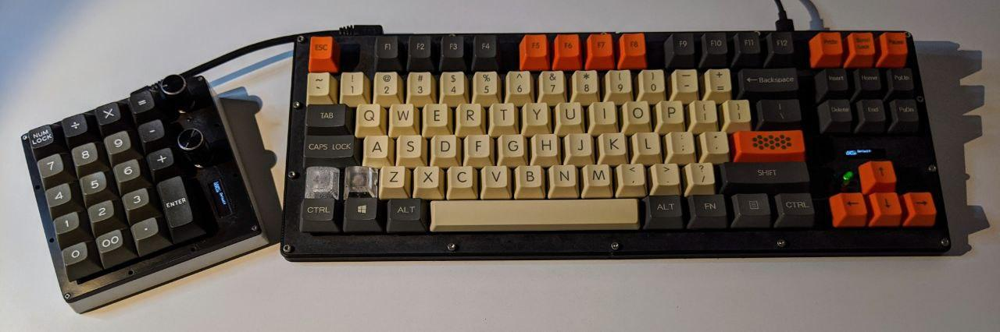
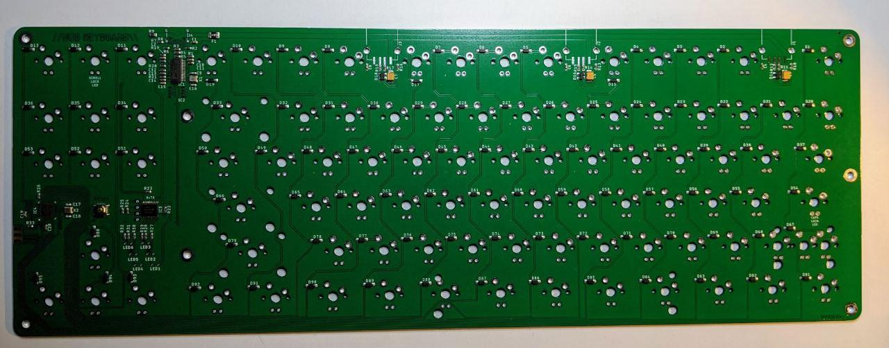
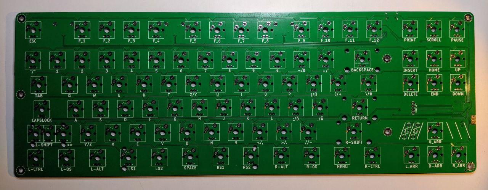

# HUB Keyboard

A custom built 80% keyboard with an OLED and an integrated USB hub.



(The  can be found here.)

## Circuit Board





The circuit board is designed in Eagle.
For easy manufacturing, the gerber-files and SMT production files are included.

The BOM and SMT placement file (CPL) are formatted for use with JLCPCB.

Apart from the keys, display, and the USB-connector all parts can be populated by JLCPCB.
The schematic contains the LCSC partnumbers in the attributes of each part.

### JLCPCB Configuration

If you want to order PCBs from JLC-PCB with the provided gerber-files,
use the following settings after uploading the zipped gerber folder:

* Layers: 2
* Dimension: 362mm x 128.5mm
* PCB Color: Choose what you want
* PCB Thickness: 1.6
* Impedance: no
* Surface Finish: HASL(with lead) (ENIG is also OK)
* Copper Weight: 1
* Gold Fingers: No
* Material Details: FR4-Standard Tg 130-140C
* Panel By JLCPCB: No
* Flying Probe Test: Fully Test
* Castellated Holes: no
* Different Design: 1
* Remove Order Number: Choose what you want

5 PCBs without assembly cost about 17.35€ or $19.60.

If you want to have the SMT parts populated, choose "SMT Assembly" and select "Bottom Layer".

When asked for the BOM and CPL file, upload the provided files.

Assembly and parts for 5 PCBs costs about 45.50€ or $55.90.


### Keys

All keys compatible with Cherry MX 2 or 3 pin should fit the board.
There a mounting holes for the US-layout (with 2.25U Left Shift) and the EU-layout (with <> next to 1.25U Left Shift).
The Spacebar can also be replaced by up 5 individual keys.

### Display

The display is an 0.91" 128x32 SPI OLED module like [this](https://www.ebay.com/itm/312892164528). They are all over ebay and aliexpress.

### Misc Parts

The USB Connectors can be found on Digikey, but you can substitute others with the same pad layout.#

* USB-C : [Digikey](https://www.digikey.com/short/zm17vb)
* USB-A : [Digikey](https://www.digikey.com/short/zm1tcc)


## QMK Configuration

The folder qmk_config contains the configuration and code to build QMK for the HUB-Keyboard.
Just put this folder in qmk/keyboards and run

```
make hub_keyboard/v1:default
```	
	
## Plate & Case

Plate and Case are available as DXF and STL files. The Case also comes in two halves for easier printing. The DXF contains lines for both layout options at the left shift key. Delete what you don't need before cutting.
